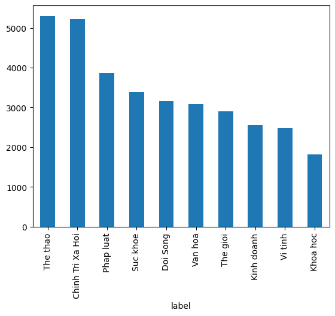
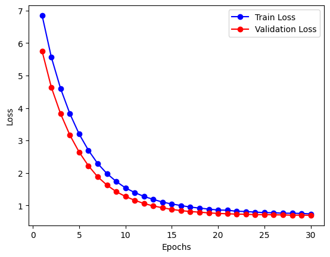
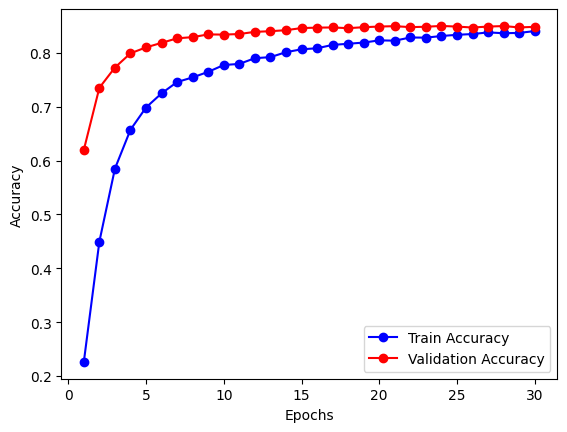

# Vietnamese Document Classification

A deep learning-based system for classifying Vietnamese documents into 10 categories, powered by **Doc2Vec** embeddings and a **Neural Network** classifier, served via a **FastAPI** REST API — deployed on Hugging Face Spaces with a Chrome Extension client.

**Live API:** https://trnqbao-vi-doc-classifier.hf.space/docs

---

## Categories

The model classifies documents into the following 10 labels:

| Label | Description |
|---|---|
| Chính Trị | Politics |
| Đời Sống | Lifestyle |
| Khoa Học | Science |
| Kinh Doanh | Business |
| Pháp Luật | Law |
| Sức Khỏe | Health |
| Thế Giới | World News |
| Thể Thao | Sports |
| Văn Hóa | Culture |
| Công Nghệ | Technology |

### Dataset Distribution



---

## Model Architecture

### Pipeline
```
Raw Text → Preprocessing → Doc2Vec Embedding → Neural Network → Label
```

### Components

**Preprocessing**
- Vietnamese tokenization using `pyvi`
- Lowercasing and stopword removal

**Embedding**
- Doc2Vec model trained on the Vietnamese document corpus
- Converts each document into a dense vector representation

**Classifier**
- Neural Network trained on Doc2Vec vectors
- Output: probability distribution over 10 categories

### Training History




---

## API Usage

The API is deployed on Hugging Face Spaces and available at:
```
https://trnqbao-vi-doc-classifier.hf.space
```

### Endpoint

```
POST /classify
```

**Request body:**
```json
{
  "text": "Lãi suất vay mượn giữa các ngân hàng nhiều phiên tăng mạnh và được dự báo khó sớm quay về mức thấp như trước."
}
```

**Response:**
```json
{
  "index": 3,
  "label": "Kinh Doanh",
  "confidence": 0.8131
}
```

### Interactive Docs

Swagger UI is available at:
```
https://trnqbao-vi-doc-classifier.hf.space/docs
```

---

## Chrome Extension

A lightweight Chrome/Edge extension that classifies selected text directly from any webpage.

### Installation

1. Clone this repository.
2. Open `edge://extensions/` (or `chrome://extensions/`).
3. Enable **Developer mode**.
4. Click **Load unpacked** → select the `chrome-extension/` folder.

### Usage

1. Select any Vietnamese text on a webpage.
2. Click the extension icon.
3. The selected text is auto-filled — click **Classify**.
4. View the predicted label and confidence score.

---

## Run Locally

### Requirements

```bash
uv add fastapi uvicorn gensim tensorflow numpy pyvi
```

### Start the server

```bash
uv run uvicorn main:app --reload
```

Swagger UI available at `http://127.0.0.1:8000/docs`.

---

## Project Structure

```
vietnamese-document-classification/
├── assets/
├── datasets/
├── models/
├── chrome-extension/
│   ├── manifest.json
│   ├── popup.html
│   ├── popup.js
│   ├── background.js
│   └── content.js
├── Training Pipeline.ipynb
├── schemas.py
├── utils.py
├── main.py
└── README.md
```